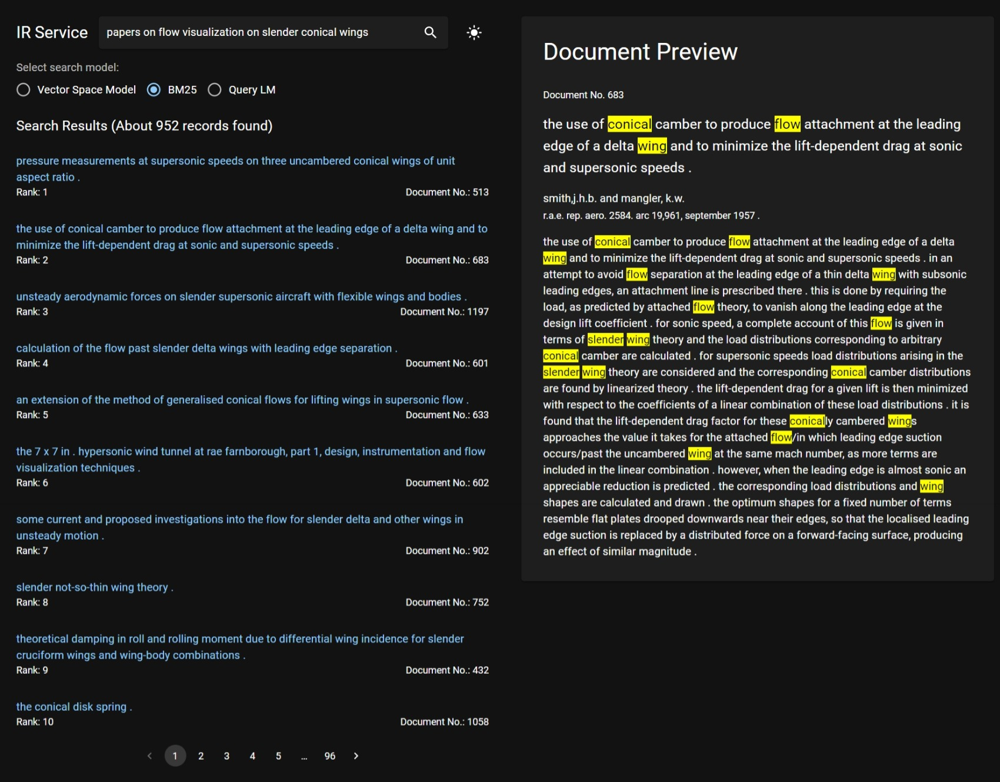

# IR Service: An Advanced Information Retrieval System

- **Aim:** To implement and evaluate high-performance search models.
- This assignment developed as part of course CA6005 (Mechanics of Search) at Dublin City University.
---



### Project Background:
The project aims to develop an Information Retrieval system using various models including the Vector Space Model, BM25, and Query Language Model with Dirichlet Smoothing. Implemented in Python for backend functionalities and React for frontend interface, the system is designed to effectively retrieve relevant information from the Cranfield TREC dataset.

### Dataset:
The project utilizes the [Cranfield TREC dataset](https://github.com/oussbenk/cranfield-trec-dataset).

### Evaluation Method:
The evaluation is conducted using [TREC eval](https://github.com/terrierteam/jtreceval). A compiled version for this can be found inside `backend/trec_eval-9.0.8-built-windows` folder.

### Project Structure:
- **install.bat**: Executes installation of required libraries for both backend and frontend.
- **start.bat**: Launches the backend and frontend servers.
- **backend folder**: Contains Python code for Flask APIs.
  - **Contents**:
    - **app.py**: Flask APIs for searching and retrieving documents.
    - **app.ipynb**: Jupyter notebook for TREC eval on different retrieval models. The TREC eval output is saved in the `output` folder.
    - **cran_reader.py**: For reading XML documents and queries.
    - **evaluation.py**: Evaluates different text retrieval models.
    - **indexing.py**: Creates an index by tokenizing, removing stopwords, lemmatizing, building word vectors, calculating document frequency, and building an inverted index.
    - **ir_system.py**: Contains services consumed by Flask API to interact with the system.
    - **retrieval_models.py**: Implements different retrieval models like Vector Space Model, BM25, and Query Language Model with Dirichlet Smoothing.
    - **requirements.txt**: Lists all required libraries.
    - **cranfield-trec-dataset folder**: Contains the Cranfield TREC dataset.
    - **trec_eval-9.0.8-built-windows folder**: Contains the TREC eval tool for evaluating retrieval models.
    - **finetune_*.ipynb**: These contain some test scripts used to finetune and optimize search models.

- **frontend folder**: Contains ReactJS code for the search engine frontend.
  - **Contents**:
    - **public folder**: Contains static files.
    - **src folder**: Contains React components and services.

### Steps to Run the Project:
1. **Installation**:
   - Download and install [Python](https://www.python.org/downloads/) and [Node.js](https://nodejs.org/en).
   - Execute `install.bat` to install all required libraries for backend and frontend. This will create a virtual environment, install requirements, install NLTK stopwords and lemmatizer, and install Node modules required for the frontend.

2. **To Start the Backend and Frontend Servers**:
   - Run `start.bat` to run the backend and frontend servers. This will host the backend server at http://127.0.0.1:5000 and the frontend server at http://127.0.0.1:3000 in 2 different command windos.
   - The browser will automatically open with the search engine.

3. **To Run TREC eval**:
   - Open `app.ipynb` using jupyter notebook and execute the cells to evaluate the retrieval models.
   - The TREC eval output will be saved in the `output` folder, and results can be viewed in the notebook itself.


### Troubleshooting:
If you encounter following error message related to installing Node modules, follow these steps:

**Error Message:**
```bash
npm ERR! enoent This is related to npm not being able to find a file.
npm ERR! enoent
```

**Solution:**
Execute the following command to resolve the issue:

```bash
npm i -g create-react-app
```

This command will install create-react-app after which you can re-run the `install.bat` file.
